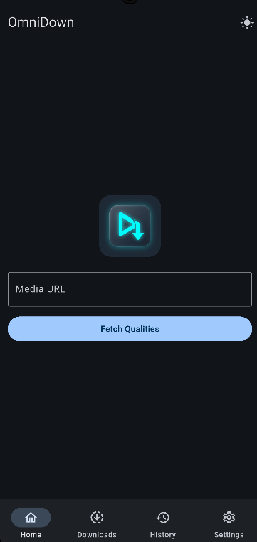
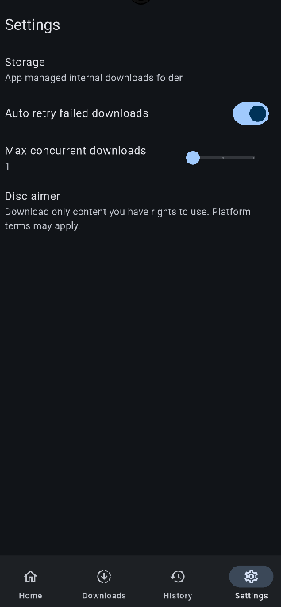

# OmniDown

OmniDown is a modern, fast, and feature-rich universal media downloader built with Flutter. It allows you to download high-quality videos and audio from various popular platforms directly to your device.

## Screenshots

| Home Screen | Settings / Downloads |
| :---: | :---: |
|  |  |

*(Note: Replace the image paths above with your actual screenshot paths once captured)*

## Features

- **Multi-Platform Support:** Seamlessly download videos and audio from YouTube, Instagram, and Twitter (X). More platforms like TikTok, Facebook, and Ok.ru are on the way.
- **High-Quality Muxing:** Automatically fetches the best visual and audio assets and merges them losslessly in the background using FFmpeg, guaranteeing the highest quality downloads.
- **Modern UI & Dark Mode:** A sleek, glassmorphic layout that is globally scrollable, combined with full system-aware and locally persisted Dark Mode support.
- **Background Downloads:** Supports asynchronous background downloading and merging to keep your app responsive.
- **Universal Architecture:** Powered by `youtube_explode_dart` and the open-source `Cobalt API` to bypass streaming blocks and captchas securely. 

## Requirements

- Flutter SDK (latest stable recommended)
- Android SDK 24+ (Requires `minSdkVersion 24` for FFmpeg integration)

## Getting Started

1. **Clone the repository:**
   ```bash
   git clone https://github.com/haydarkadioglu/omnidown.git
   cd omnidown
   ```

2. **Install dependencies:**
   ```bash
   flutter pub get
   ```

3. **Run the app:**
   ```bash
   flutter run
   ```

## Technical Details

- **State Management:** `provider`
- **HTTP Client:** `dio`
- **Video Extraction:** `youtube_explode_dart` & Cobalt API (`cobalt_api_service`)
- **Muxing & Merging:** `ffmpeg_kit_flutter_new` (min-gpl)
- **Local Storage:** `shared_preferences` & `sqflite`

## License
Feel free to open issues or contribute to the project to broaden platform support.
